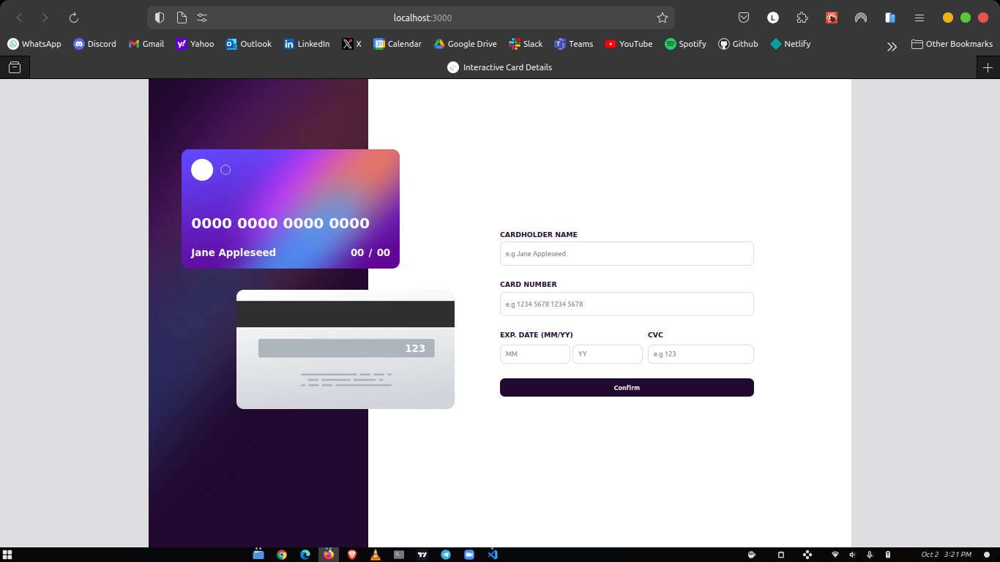
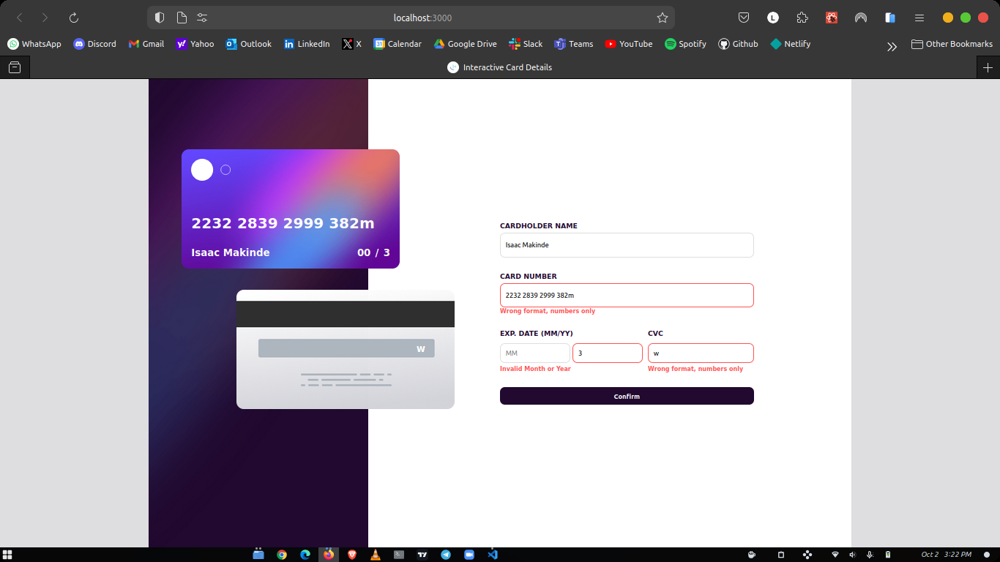
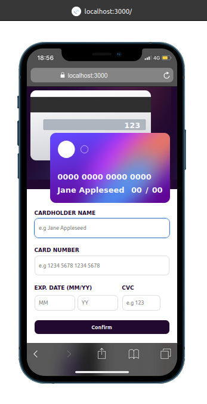
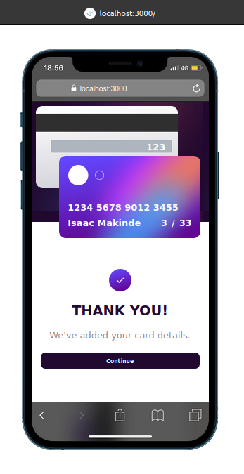

# Frontend Mentor - Interactive card details form solution

This is a solution to the [Interactive card details form challenge on Frontend Mentor](https://www.frontendmentor.io/challenges/interactive-card-details-form-XpS8cKZDWw). Frontend Mentor challenges help you improve your coding skills by building realistic projects.

## Table of contents

- [Overview](#overview)
  - [The challenge](#the-challenge)
  - [Screenshot](#screenshot)
  - [Links](#links)
  - [Built with](#built-with)
- [Author](#author)

## Overview

### The challenge

Users should be able to:

- Fill in the form and see the card details update in real-time
- Receive error messages when the form is submitted if:
  - Any input field is empty
  - The card number, expiry date, or CVC fields are in the wrong format
- View the optimal layout depending on their device's screen size
- See hover, active, and focus states for interactive elements on the page

### Screenshot

### Links

- [Github](https://github.com/Oluwa-Laughter/interactive-card-details)
- [Live-link](https://isaac-interactive-card.vercel.app/)

### Built with

- [React](https://reactjs.org/) - JS library
- Javascript
- React hooks (useState)
- Vanilla CSS for Styling

### What I learned

I learnt to use React useState hook to keep the form data as objects, regex for card number, date & cvc checks, also used controlled components for real-time input.

## Author

- Website - [Isaac Makinde](https://github.com/Oluwa-Laughter)
- Twitter - [LAUGHTER](https://www.x.com/isaacmakinde_)
- LinkedIn - [Isaac Makinde](https://www.linkedin.com/in/isaacmakinde)
